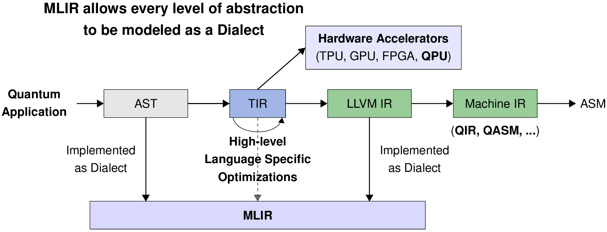
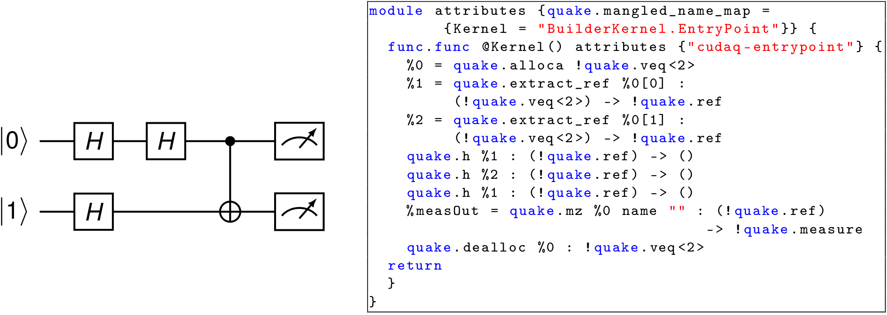
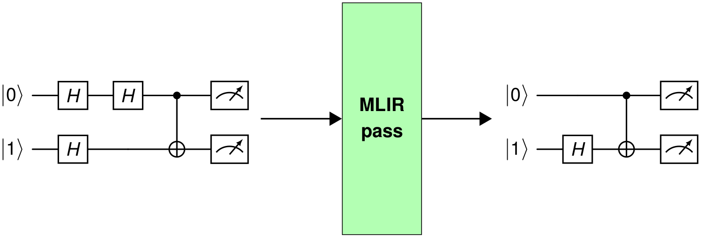
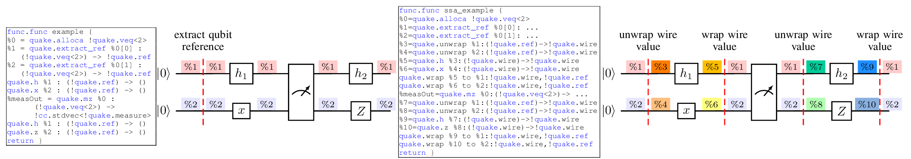
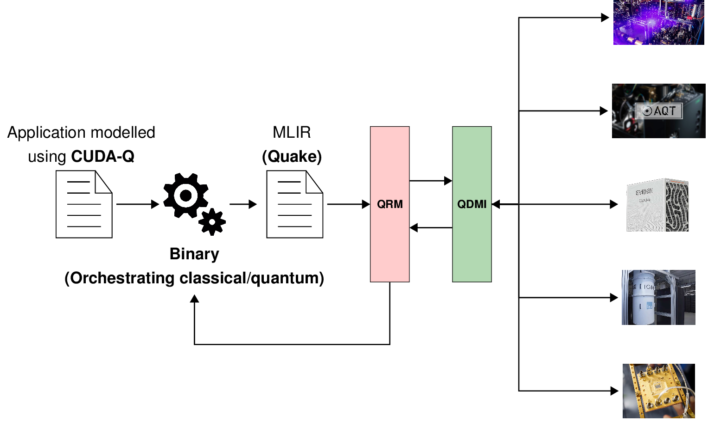

# Collection of MLIR Passes of the Stack

<!-- [DOXYGEN MAIN] -->

This repository holds a collection of MLIR passes that operate on Quantum programs to optimize,
transform, and lower quantum circuits to instructions compliant with the target devices. The
presented passes are integrated into the [double blind review] Stack infrastructure. In
particular, this collection of passes is used in the Quantum Resource Manager (QRM) to optimize,
transform, and lower quantum programs to quantum devices. The passes stored in this collection can
be classified as target-agnostic and target-specific. Target agnostic passes can be applied to any
quantum circuit and do not require information on the selected quantum target device. In contrast,
target-specific passes tightly depend on the selected quantum device. For instance, transpilation
passes that convert a quantum circuit defined using arbitrary gates to a quantum circuit compliant
with the native gate set of the selected quantum device.

<!-- [DOXYGEN MAIN] -->

  Documentation: [double blind review]

## FAQ

<!-- [DOXYGEN FAQ] -->

### What is the Stack?

The Stack [double blind review] provides a comprehensive compilation and runtime infrastructure for on-premise and remote
quantum devices, supports modern compilation and optimization techniques, and enables current and
future high-level abstractions for quantum programming. This stack is designed to deploy in various
scenarios via flexible configuration options, including stand-alone scenarios for individual
systems, cloud access to multiple devices, and tight integration into HPC environments supporting
quantum acceleration. It facilitates the connection between end-users and
quantum computing platforms by its integration within HPC infrastructures, such as those found at
the [double blind review] supercomputing center.

### What is MLIR?

MLIR (Multi-Level Intermediate Representation) is a versatile compiler framework for developing
domain-specific compilers and optimizing transformations. MLIR originated as part of the LLVM
ecosystem and is particularly tailored for modern, complex computational workflows, including
machine learning, AI, and heterogeneous hardware.

MLIR supports multiple levels of abstraction within a single framework, allowing developers to work
with high-level domain-specific operations down to hardware-specific operations. Users can define
their **dialects** (custom operations and types) for specific problem domains while leveraging the
shared infrastructure for optimization and code generation already provided by MLIR.

    

Additionally, MLIR promotes interoperability among different models of computation and supports
**optimization passes** across various abstraction levels, including high-level and low-level
operations.

For more information on [MLIR](https://github.com/llvm/llvm-project.git).

### What is an MLIR Dialect?

An MLIR dialect is a modular and extensible namespace within the MLIR framework that defines a set
of **operations**, **types** and **attributes** specific to a domain, language, or model of
computation. Dialects enable MLIR to be a highly flexible intermediate representation (IR).

For instance, **Quake** is an MLIR dialect designed for quantum computing. It serves as part of
NVIDIA's CUDAQ framework, facilitating the development, optimization, and deployment of
quantum-classical hybrid programs. Quake represents quantum programs within MLIR, providing a
high-level abstraction for quantum operations and allowing developers to leverage the MLIR
infrastructure for optimization and compilation. Below is an example of a quantum circuit and its
corresponding representation using Quake. Each instruction at MLIR level matches the gates
represented in the diagram. Though, at first, this representation might resemble other
representations such as QASM and QIR, there exists a difference in the flexibility of the
representation that allows transformations at different levels of abstraction, which is provided by
the MLIR framework.

    

For more information on [QUAKE MLIR Dialect](https://github.com/NVIDIA/cuda-quantum.git).

### What is an MLIR pass?

An MLIR pass is a transformation or analysis applied to an MLIR intermediate representation (IR) to
**modify**, **optimize**, or **gather information**. Passes are a central concept in compiler
frameworks, including MLIR, enabling modular, reusable,and extensible code transformations at
various abstraction levels.

    

For instance, in the figure above, an MLIR optimization pass is applied to the input example
circuit, which contains two consecutive Hadamard gates on qubit 0. Accordingly, in the
output-optimized circuit shown on the right, those two consecutive Hadamards are removed because
they are equivalent to an identity operation.

MLIR has two categories of passes: **transformation** passes and **analysis** passes. The pass
presented above is a transformation pass. Moreover, passes can be applied in sequences defined as
**pass pipelines**.

### Why include MLIR into the Stack?

One fundamental feature of MLIR is its ability to model different levels of abstraction related to a
domain-specific language. In contrast, Quantum representations such as the QIR or QASM are
instruction-level representations. Performing transformations on a low-level abstraction, such as
instruction-level, might not be a good choice. Instruction-level representations are a list of
quantum gates that operate on qubits. The figure below shows a non-compliant and a compliant SSA
MLIR/Quake quantum kernel on the left and right, respectively. The problem with using
representations that do not expose the data dependencies, as shown on the left and QIR, is that the
compiler might apply incorrect transformations during optimization.

    

The representation presented on the left assumes a value referencing each qubit. Values %1 and %2
correspond to qubits 1 and 2, respectively. By following only the value %1, the compiler might
wrongly assume that _h1_ has produced the value %1 and is immediately consumed by _h2_. The compiler
will try to remove gates _h1_ and _h2_ since two consecutive Hadamard gates result in an identity.
However, following this assumption, the compiler could ignore the fact that a measurement exists
between the two gates. Thus, representations using values referencing qubits might not be a good
choice when applying transformation that relies on the data dependencies among gates. In contrast,
as presented on the figure's right, an SSA-compliant representation exposes the data dependencies
without ambiguity since each gate consumes/produces values.

These values can also be visualized as the wires connecting the gates in the quantum circuit.
Accordingly, there is no ambiguity in the representation, and eliminating _h1_ and _h2_ is
impossible because both gates reference different values at their output and input, respectively.
There, gate _h1_ consumes the value %3, corresponding to unwrapping the qubit reference value %1,
and producing the value %5. Gate _h2_ consumes the value %7 corresponding to unwrapping the qubit
reference value %1 after the measurement. Accordingly, there is no ambiguity in the representation,
and eliminating _h1_ and _h2_ is impossible because both gates reference different values at their
output and input, respectively.

### Where do MLIR passes fit into the Stack?

The collection of MLIR passes stored in this repository is part of the Stack [double blind review]. The passes are utilized inside the Quantum Resource Manager
(QRM, [double blind review]).

    

For example, a hybrid quantum application can be defined in a high-level programming language such
as C++ using the CUDAQ library. Those code fragments in a hybrid quantum application defined as
quantum kernels will be submitted to the QRM.

By specifying the target as [blind review] at compilation time, the generated binary will orchestrate the
classical and quantum resources. Every time a quantum kernel has to be executed, the compiled binary
submits the MLIR code of the correspondent quantum kernel to the  stack. Thus, on the Stack side,
the MLIR module is processed by the QRM, which perform **agnostic passes** (optimization passes) and
**target-specific passes** (transpilation passes and lowering passes). The lowered code is sent to
the Quantum device, and the results are collected and sent back to the hybrid application.

### Where is the code?

The code will be made publicly available on GitHub upon publication [double blind review].

### Under which license is this collection of passes released?

This collection of MLIR passes is released under the Apache License v2.0 with LLVM Exceptions. See
the LICENSE file included in this repository for more information. Any contribution to the project
is assumed to be under the same license.

<!-- [DOXYGEN FAQ] -->
